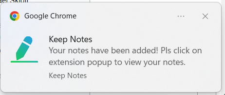
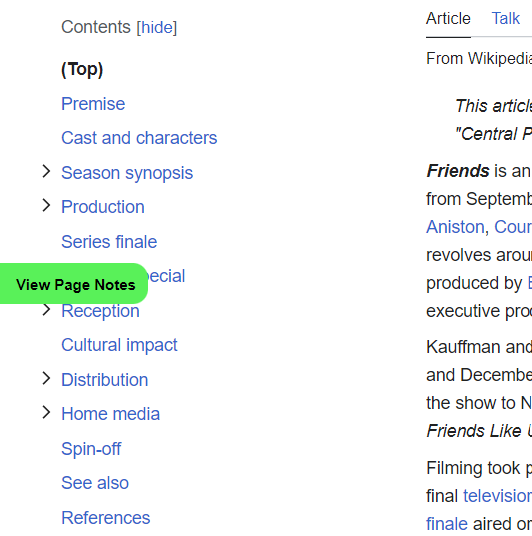
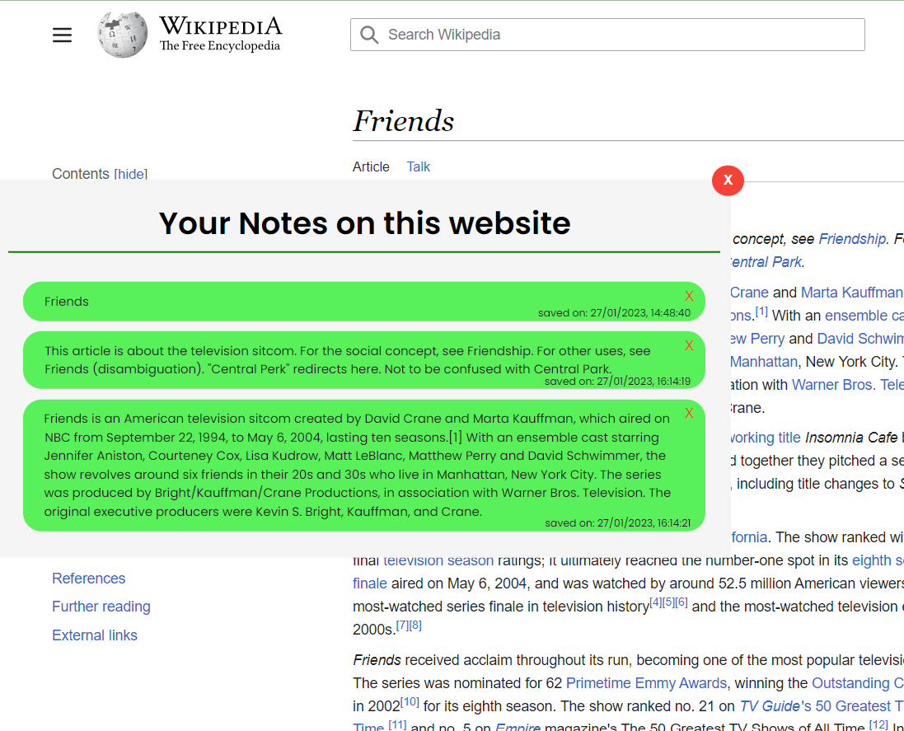

# Keep Notes 

-   Save notes on any website, view notes and download it whenever you want!

## Features

-   Add note using button after selection
-   View recent note in popup along with time
-   Download page note or all websites note from popup
-   Delete all notes or all current websites notes from popup
-   View notes of current website in floating window after clicking on "view page notes" button
-   Remove any single note from floating window
-   Listen the recent note in popup using play button

## Screenshots

#### here are some of the screenshots that help you exploring the extension

-   
As on your first visit you not saved any note so popup will look like this

    

 

-   
when you select some text you can see the floating button like this and you can save note by click on this button.

    

 

-   
You will get the notification like this. when note is saved

    

 

-   
after adding some notes you can see the last note inside your popup and also have buttons to download or delete the notes

    

 

-   
on the left side of webpage you will get one button like this and on click of this button you can see all notes of that website in floating window like this:

    
    

 

-   
You can remove specific note using "X" button in floating window like this:

    

 

-   
You can delete all notes of current website or all notes from all the website using this two buttons inside the popup:

    

 

## How to install

-   Clone/Download this repository
-   Follow the instructions mentioned [here](https://developer.chrome.com/docs/extensions/mv3/getstarted/#manifest)

 
> Hope you liked it!
>  
> If you have any issue with working of extension or want to give feedback then you can contact me at bhimanimeet55555@gmail.com >  
> Thank you for visit!
